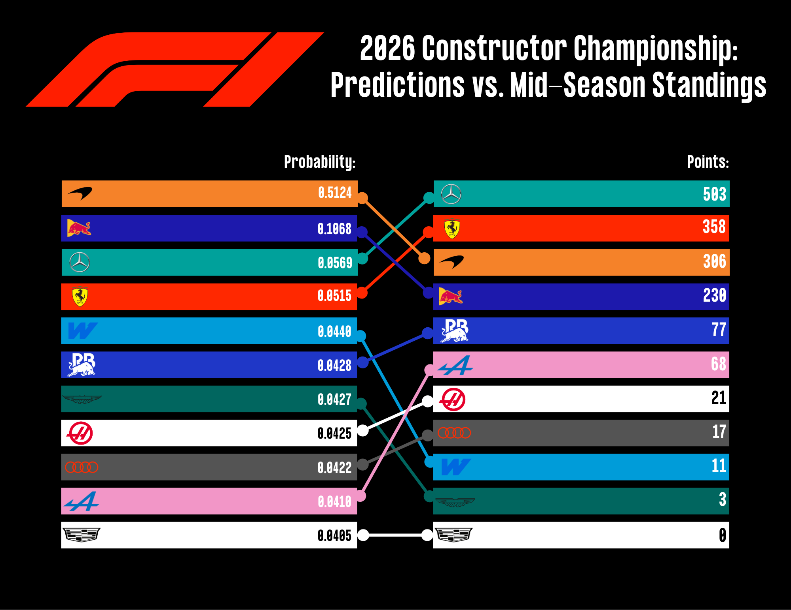

# Formula One Constructor Championship Predictions 🏎️

## Introduction

Formula One teams analyze massive volumes of data to design, develop, and optimize cars capable of winning the World Constructors’ Championship. While much of this data remains proprietary, historical trends still provide valuable insight into team performance.

## Project Goal

This project builds a predictive model using over two decades of publicly accessible performance data to forecast the Formula One Constructors’ Champion before the season begins.

## Results

The final model generates preseason probabilities for each Formula One constructor and can be evaluated against the completed season standings.

### 2026 Championship Predictions

<p align="center">
  
</p>

<p align="center">
<em>Preseason predicted probability of each constructor winning the 2026 Formula One Constructors' Championship.</em>
</p>

### Predictions vs. Mid-Season Standings

<p align="center">
  
</p>

<p align="center">
<em>Comparison of the model's preseason predictions with the final 2026 Constructors' Championship standings.</em>
</p>

## Data Description

The `raw_data_2026.csv` dataset includes constructor-level seasonal performance data from the Formula One World Championship since the turn of the century.

The target variable, `Constructor_Champion`, is a binary indicator of whether a constructor won the championship in a given season.

Supplementary driver-level datasets are also included, which document driver experience, measured by the number of race starts and laps completed throughout their careers.

## Data Sources

Seasonal constructor entry and results data were collected from official championship records and supplemented with historical data from external sources:
- [Formula 1 Results](https://www.formula1.com/en/results.html)
- [F1 Fansite Archive](https://www.f1-fansite.com/all-time-f1-archive/)

Constructor lineage, branding continuity, and ownership transitions were compiled using documentation from the Fédération Internationale de l’Automobile (FIA) and cross-referenced with the Formula 1 Lineage Project:
- [Formula 1 Teams and Drivers Over the Years](https://flamingtempura.github.io/formula1-lineage/)

Information regarding major regulation changes was obtained from the following reference:
- [The Key Regulation Changes in F1 History](https://www.formula1.com/en/latest/article/the-key-regulation-changes-in-f1-history-and-the-teams-that-nailed-them.2iq8c5E6S1HOffT5PBLl6i)

## Repo Files

### Data
- `Data Files/`
  - `laps_completed.csv`: Historical Grand Prix lap totals for drivers competing since 2000.
  - `race_starts.csv`: Historical Grand Prix start totals for drivers competing since 2000.
  - `raw_data_2026.csv`: Constructor-level dataset spanning the 2000 to 2026 seasons prior to preprocessing.

### Scripts
- `Feature_Engineering.py`: Cleans the raw dataset, engineers model features, and creates the training and holdout datasets.

### Data Analysis
- `EDA.qmd`: Exploratory data analysis, data quality assessment, feature exploration, and multicollinearity analysis.
- `Modeling.qmd`: Model training, hyperparameter tuning, expanding window cross validation, performance evaluation, and 2026 championship predictions.

### Documentation

- `Data_Dictionary.xlsx`: Definitions and descriptions of all variables used in the dataset.
- `README.md`: Project overview, repository structure, setup instructions, and workflow.
- `requirements.txt`: Python package dependencies required to reproduce the project environment.

### Configuration
- `.gitignore`: Specifies files and directories excluded from version control.

### Additional Materials
- `Additional_Materials/`
  - `Web_Scraping/`: Quarto (`.qmd`) documents written in R that were used to scrape and compile the `raw_data_2026.csv` dataset.
  - `2026 Predictions.png`: Graphic displaying the model's predicted probability of each constructor winning the 2026 Formula 1 Constructors' Championship.
  - `Formula1-Regular.ttf`: Official Formula 1 font used to create the `2026 Predictions.png` graphic.


## Setup Instructions

### 1) Clone the repository

```bash
git clone https://github.com/owen-simon/Formula-1-Constructor-Repository.git
cd Formula-1-Constructor-Repository
```

### 2) Install Required Dependencies

```bash
pip install -r requirements.txt
```

### 3) Run Feature Engineering Script

```bash
python Feature_Engineering.py
```

### 4) Confirm Outputs

Processed datasets should appear in the `Data_Files/` folder.
